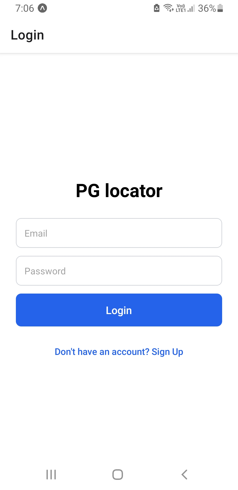
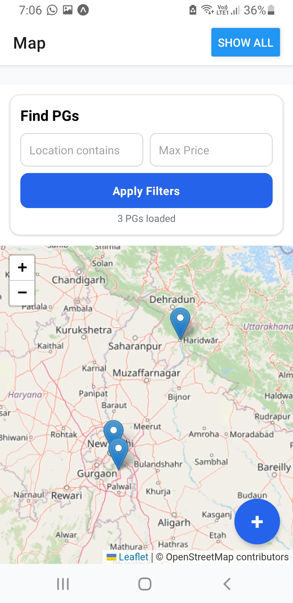
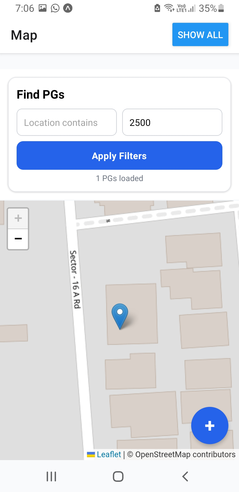
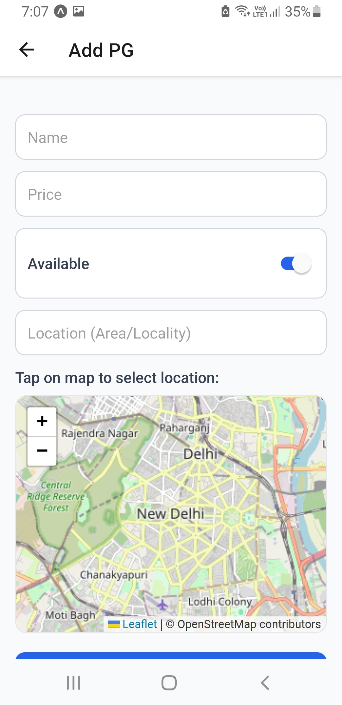
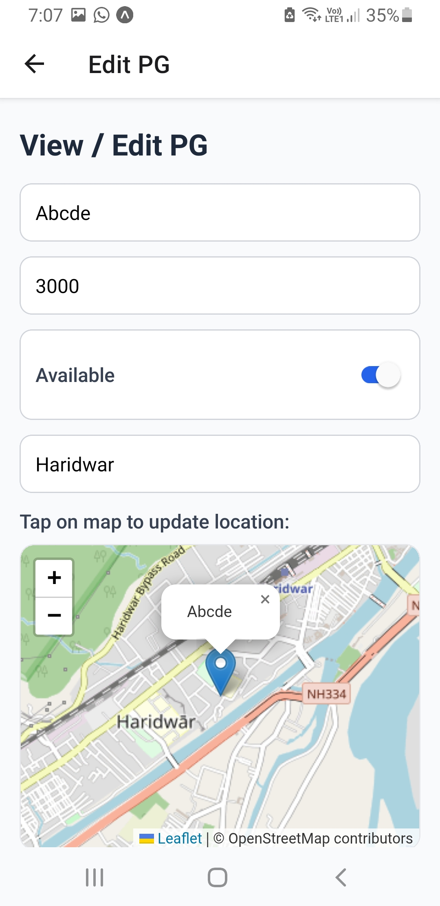

# 🏠 PG Finder – React Native App for Managing & Exploring PG Accommodations

A React Native mobile application that helps users discover, add, and manage PG (Paying Guest) accommodations with an interactive map-based interface powered by Leaflet.
The app uses Firebase Authentication for secure user login and a Node.js + Express + MongoDB backend hosted on Vercel for real-time data management.

# 🚀 Features

### ✅ 🔐 Firebase Authentication
Secure login and signup with Firebase (Email/Password).

### ✅ 🗺️ Map-based Location Selection
Choose PG locations or explore existing ones using an interactive Leaflet map.

### ✅ 🏘️ PG Management
Add, view, edit, and delete PG listings with details such as rent, description, and location.

### ✅ ⚡ Real-time Availability Toggle
Switch a PG’s status between Available and Occupied instantly.

### ✅ 🎯 Advanced Filters
Filter PG listings based on location proximity and price range for a personalized search experience.

### ✅ ☁️ Hosted Backend on Vercel
No local setup required — the app connects to a live REST API hosted online.

### ✅ 📱 Intuitive UI & Smooth Navigation
Built using React Navigation for seamless transitions across multiple screens.

# 📸Screenshots
<br>


# 🧰 Tech Stack
### Frontend
⚛️ React Native,
🗺️ Leaflet (for map view and location selection),
🌐 Axios (for API communication),
🧭 React Navigation,

### Backend
🟢 Node.js,
⚙️ Express.js,
🍃 MongoDB (Mongoose ODM)

# ⚙️ Installation & Setup
### 1️⃣ Clone the Repository
```
git clone https://github.com/Saransh719/PG-locator.git
cd PG-locator
```
### 2️⃣ Install Dependencies
```
npm install
```
### 3️⃣ Setup .env
Create a .env file in the root folder:
```
# Backend API
BASE_URL=https://pg-locator-deploy.vercel.app/

# Firebase Configuration
FIREBASE_API_KEY=your_firebase_api_key
FIREBASE_AUTH_DOMAIN=your_firebase_auth_domain
FIREBASE_PROJECT_ID=your_firebase_project_id
FIREBASE_STORAGE_BUCKET=your_firebase_storage_bucket
FIREBASE_MESSAGING_SENDER_ID=your_firebase_messaging_sender_id
FIREBASE_APP_ID=your_firebase_app_id
```
# 📬 Support & Feedback
Have questions or feature suggestions? Reach out at: saranshsapra08@gmail.com

